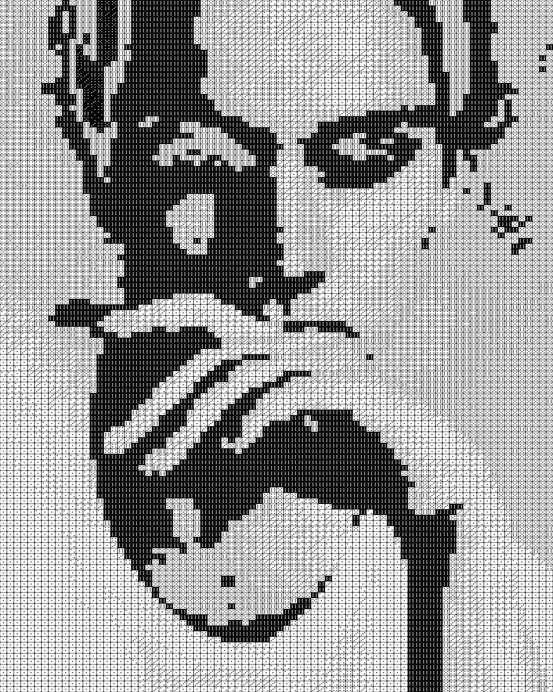

# 🖼️ Image to Dices 🎲

Little project made in one hour that recreate an image with six-faced dices

## Results

|         Initial image          |          Result          |
| :----------------------------: | :----------------------: |
|  |  |

## How to use

On linux or wsl:

```bash
python -m venv .venv
source .venv/bin/activate
pip install -r requirements.txt
python . <path_to_image> <path_to_output>
```

### Todo : Make a python module
